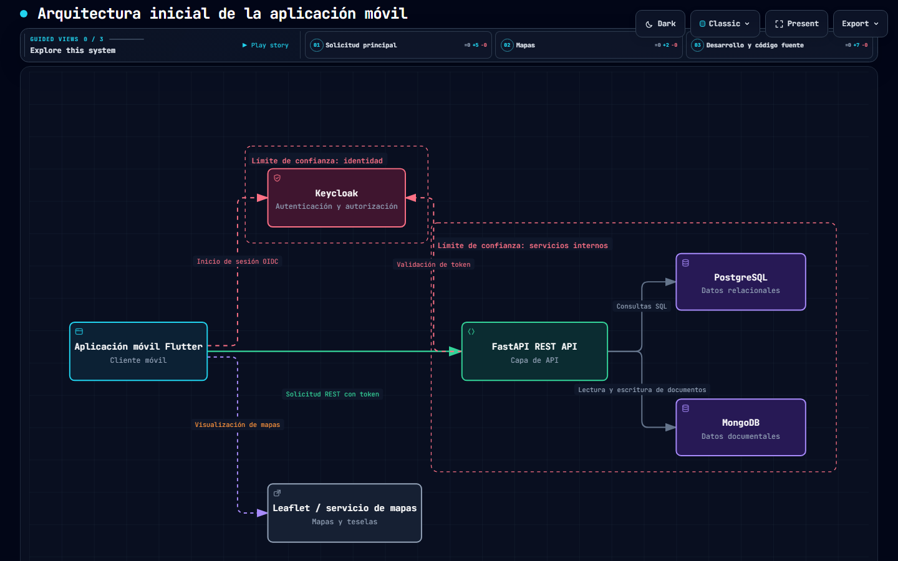
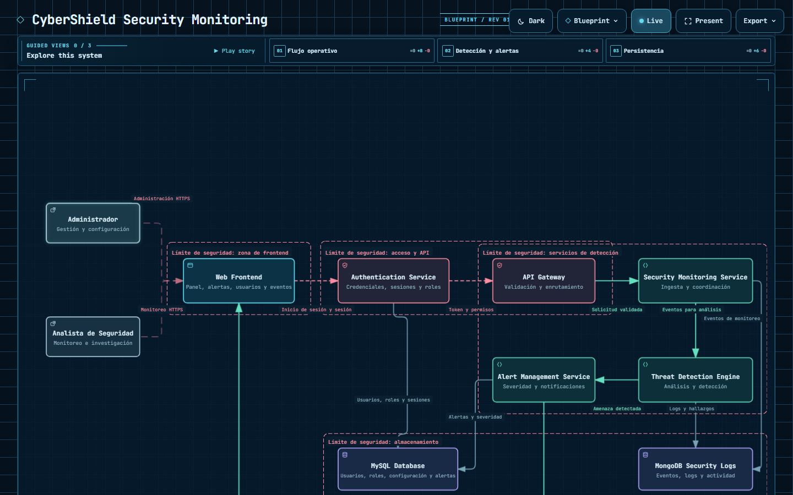
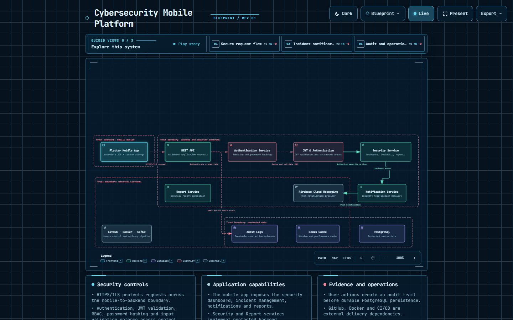

# Documentación - Prácticas Integradora 230308

Repositorio de modelado arquitectónico de sistemas de ciberseguridad para la materia **Integradora**. Los diagramas se generan con **Archify** y se publican como HTML interactivo mediante GitHub Pages.

---

## Índice

1. [Descripción general](#descripción-general)
2. [Contenido del repositorio](#contenido-del-repositorio)
3. [Arquitecturas modeladas](#arquitecturas-modeladas)
   - [Arquitectura inicial de la aplicación móvil](#1-arquitectura-inicial-de-la-aplicación-móvil)
   - [CyberShield Security Monitoring](#2-cybershield-security-monitoring)
   - [Cybersecurity Mobile Platform](#3-cybersecurity-mobile-platform)
4. [Elementos comunes de los diagramas](#elementos-comunes-de-los-diagramas)
5. [Tabla de prácticas](#tabla-de-prácticas)
6. [Cómo visualizar los diagramas](#cómo-visualizar-los-diagramas)
7. [Requisitos y herramientas](#requisitos-y-herramientas)

---

## Descripción general

El proyecto modela visualmente los principales componentes, servicios y flujos de comunicación de sistemas orientados al **monitoreo y protección de la información**. Cada diagrama se define mediante un archivo JSON (fuente editable) y se convierte a un **HTML interactivo** con SVG inline, temas claro/oscuro, animación de trazos y exportación a imágenes.

Los tres modelos representan:

- Una aplicación móvil con autenticación, API REST y doble persistencia.
- Una plataforma web de monitoreo de seguridad (SOC).
- Una plataforma móvil de ciberseguridad con control de acceso, notificaciones y auditoría.

---

## Contenido del repositorio

| Archivo | Descripción |
|---------|-------------|
| `README.md` | Vista general y tabla de prácticas (raíz). |
| `arquitectura-inicial.json` | Fuente del diagrama *Arquitectura inicial de la aplicación móvil*. |
| `arquitectura-inicial-interactiva.html` | Diagrama interactivo en HTML generado con Archify. |
| `arquitectura-inicial-interactiva.visual-check*` | Capturas de verificación visual del diagrama. |
| `cybershield-architecture.json` | Fuente del diagrama *CyberShield Security Monitoring*. |
| `cybershield-architecture.html` | Diagrama interactivo en HTML (CyberShield). |
| `cybershield-architecture.visual-check*` | Capturas de verificación visual (CyberShield). |
| `cybershield-architecture copy.html` / `copy.json` | Copias de respaldo de la versión anterior. |
| `mobile-cybersecurity-architecture.json` | Fuente del diagrama *Cybersecurity Mobile Platform*. |
| `mobile-cybersecurity-architecture.html` | Diagrama interactivo en HTML (Cybersecurity Mobile Platform). |
| `Doc/README.md` | Documentación técnica del repositorio (este archivo). |
| `Doc/img/` | Capturas de los diagramas usadas en esta documentación. |
| `.vscode/settings.json` | Configuración local de Live Server (puerto 5501). |

---

## Arquitecturas modeladas

### 1. Arquitectura inicial de la aplicación móvil

**Archivo:** `arquitectura-inicial.json` → **Salida:** `arquitectura-inicial-interactiva.html`

Representa el esqueleto inicial del sistema móvil con tres vistas: solicitando principal, integración de mapas y entorno de desarrollo.

**Componentes:**

| Tipo | Componente | Rol |
|------|-----------|-----|
| Frontend | Aplicación móvil Flutter | Cliente móvil (Android / iOS). |
| Seguridad | Keycloak | Autenticación y autorización (OIDC / OAuth 2.0). |
| Backend | FastAPI REST API | Capa de API (HTTPS / JSON). |
| Base de datos | PostgreSQL | Datos relacionales (SQL). |
| Base de datos | MongoDB | Datos documentales. |
| Externo | Leaflet / servicio de mapas | Mapas y teselas. |
| Nube | Docker / Docker Compose | Contenedores y orquestación local. |
| Externo | Git / GitHub | Control de versiones y repositorio remoto. |

**Flujo principal:**
1. Flutter autentica al usuario con Keycloak.
2. La app llama a FastAPI con el token de acceso.
3. FastAPI consulta PostgreSQL y MongoDB según el tipo de dato.
4. El frontend visualiza mapas mediante el servicio externo Leaflet.

**Límites de confianza:**
- Keycloak concentra la identidad y emisión de tokens.
- La API y las bases de datos permanecen en servicios internos.
- El servicio de mapas se trata como dependencia externa.

---

### 2. CyberShield Security Monitoring

**Archivo:** `cybershield-architecture.json` → **Salida:** `cybershield-architecture.html`

Sistema de monitoreo de seguridad tipo SOC (Security Operations Center) con preset visual *blueprint* y animación de trazo.

**Componentes:**

| Tipo | Componente | Rol |
|------|-----------|-----|
| Externo | Administrador | Gestión y configuración. |
| Externo | Analista de Seguridad | Monitoreo e investigación. |
| Frontend | Web Frontend | Panel, alertas, usuarios y eventos. |
| Seguridad | Authentication Service | Credenciales, sesiones y roles. |
| Seguridad | API Gateway | Validación y enrutamiento (punto de entrada). |
| Backend | Security Monitoring Service | Ingesta y coordinación de eventos. |
| Backend | Threat Detection Engine | Análisis y detección de amenazas. |
| Backend | Alert Management Service | Severidad y notificaciones. |
| Base de datos | MySQL | Usuarios, roles, configuración y alertas. |
| Base de datos | MongoDB Security Logs | Eventos, logs y actividad. |

**Flujo de operación:**
1. Administrador y analista acceden al frontend vía HTTPS.
2. El frontend inicia sesión en el Authentication Service.
3. El API Gateway valida tokens y enruta las solicitudes.
4. El Security Monitoring Service ingesta eventos y envía al Threat Detection Engine.
5. Las amenazas detectadas se clasifican en Alert Management y se notifican al panel.
6. Los datos estructurados se persisten en MySQL y los registros en MongoDB.

---

### 3. Cybersecurity Mobile Platform

**Archivo:** `mobile-cybersecurity-architecture.json` → **Salida:** `mobile-cybersecurity-architecture.html`

Plataforma móvil de ciberseguridad (playbook en inglés) que enfatiza el control de acceso, la evidencia de auditoría y la entrega de notificaciones.

**Componentes:**

| Tipo | Componente | Rol |
|------|-----------|-----|
| Frontend | Flutter Mobile App | Cliente móvil con almacenamiento local seguro. |
| Backend | REST API | Solicitudes validadas (HTTPS/TLS, input validation). |
| Seguridad | Authentication Service | Identidad y hash de contraseñas. |
| Seguridad | JWT & Authorization | Validación JWT y control de acceso por roles (RBAC). |
| Backend | Security Service | Panel, incidentes y reportes de seguridad. |
| Backend | Notification Service | Entrega de notificaciones de incidentes. |
| Externo | Firebase Cloud Messaging | Proveedor de notificaciones push. |
| Base de datos | PostgreSQL | Datos protegidos del sistema. |
| Base de datos | Redis Cache | Caché de sesión y rendimiento. |
| Base de datos | Audit Logs | Evidencia inmutable de acciones de usuarios. |
| Backend | Report Service | Generación de reportes de seguridad. |
| Externo | GitHub · Docker · CI/CD | Control de versiones y entrega continua. |

**Controles de seguridad destacados:**
- HTTPS/TLS protege las solicitudes a lo largo del límite móvil-backend.
- Autenticación, validación JWT, RBAC, hash de contraseñas y validación de entrada refuerzan el control de acceso.
- Las acciones de usuario generan una pista de auditoría previa a la persistencia en PostgreSQL.
- GitHub, Docker y CI/CD son dependencias externas de entrega.

---

## Elementos comunes de los diagramas

Todos los diagramas comparten una misma estructura definida en JSON:

- **`meta`**: título, preset visual, animación, vistas focales y leyenda.
- **`views`**: vistas o sub-diagramas que resaltan un subconjunto de componentes (ej. *Flujo operativo*, *Detección y alertas*).
- **`components`**: nodos tipados (frontend, backend, security, database, external, cloud).
- **`boundaries`**: límites de confianza o zonas de seguridad que agrupan componentes.
- **`connections`**: aristas con etiqueta y variante (security, emphasis, dashed) que describen los flujos.
- **`cards`**: tarjetas informativas que resumen el sistema.

**Paleta de tipos en la leyenda:**

| Tipo | Significado |
|------|-------------|
| Externo | Usuarios y dependencias fuera del sistema. |
| Frontend | Interfaces de usuario. |
| Seguridad | Control de acceso e identidad. |
| Backend | Servicios internos. |
| Base de datos | Almacenamiento. |

---

## Tabla de prácticas

| # | Nombre de la práctica | Descripción | Firmas | Estatus |
|---|------------------------|--------------|--------|---------|
| 01 | Metodología de Evaluación de la Materia | Revisión de la forma en que se evaluará la materia durante el cuatrimestre. | 05 | Completada |
| 02 | Práctica 02 - Boceto de Arquitectura con Archify | Instalación y configuración de Archify (agente de modelado arquitectónico) con interacción con Codex de OpenAI. Se generó un diagrama de arquitectura interactivo en HTML del sistema, incluyendo capa móvil, autenticación, API, datos, servicios externos e infraestructura de desarrollo. | 24 | Completada |

---

## Cómo visualizar los diagramas

Las salidas HTML son archivos autocontenidos: basta abrirlos en cualquier navegador.

**Opción rápida (recomendada):** doble clic sobre el archivo `.html` del diagrama.

**Con servidor local (Live Server en VS Code):**
1. Abrir la carpeta del proyecto en VS Code.
2. Instalar la extensión **Live Server** (configurado en el puerto `5501`).
3. Clic derecho sobre el HTML del diagrama → **Open with Live Server**.

---

## Requisitos y herramientas

| Herramienta | Propósito |
|-------------|-----------|
| Archify | Modelado y generación de diagramas HTML interactivos. |
| Codex (OpenAI) | Soporte de IA durante el modelado arquitectónico. |
| Navegador web | Visualización de los diagramas generados. |
| VS Code + Live Server | Servidor local de desarrollo. |
| GitHub Pages | Publicación de los diagramas en línea. |