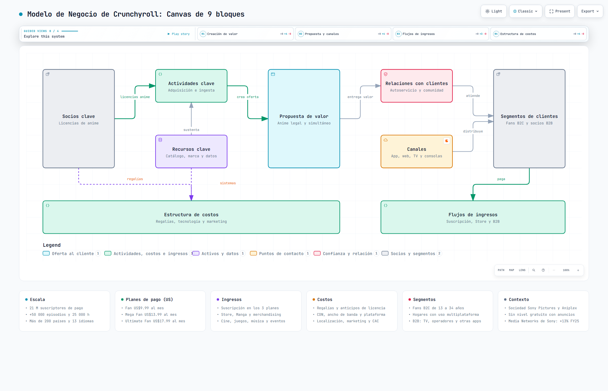

# Práctica 03 — Modelo de Negocio (Business Model Canvas) con Archify

Modelado del **Business Model Canvas de Crunchyroll** (herramienta multiplataforma
de streaming de anime) generado con **Archify** y publicado como HTML interactivo
mediante GitHub Pages.

---

## Entregable

| | |
|---|---|
| **Abrir el diagrama (GitHub Pages)** | [bmc-crunchyroll.html](https://br1anj3sus3b.github.io/Practicas_Integradora_Brian-230308/Practica03/bmc-crunchyroll.html) |
| **Abrir la vista ampliada** | [bmc-crunchyroll-detalle.html](bmc-crunchyroll-detalle.html) · [en GitHub Pages](https://br1anj3sus3b.github.io/Practicas_Integradora_Brian-230308/Practica03/bmc-crunchyroll-detalle.html) |
| **Abrir en local** | doble clic en [`bmc-crunchyroll.html`](bmc-crunchyroll.html) |
| **Especificación fuente** | [`bmc-crunchyroll.json`](bmc-crunchyroll.json) (edítala y vuelve a entregar) |
| **Especificación de la vista ampliada** | [`bmc-crunchyroll-detalle.json`](bmc-crunchyroll-detalle.json) |
| **Línea base v1** | [`bmc-crunchyroll-v1.html`](bmc-crunchyroll-v1.html) · [`bmc-crunchyroll-v1.json`](bmc-crunchyroll-v1.json) |
| **Vista previa** |  |

---

## Contenido

| Archivo | Descripción |
|---------|-------------|
| `README.md` | Este documento. |
| `prompts/prompt-v1.md` | **Prompt v1** tal como se entregó a Archify, con su descomposición de intención. |
| `prompts/prompt-v2.md` | **Prompt v2:** qué cambió y por qué, decisiones de diseño e iteración durante la aceptación. |
| `prompts/prompt-v3.md` | **Prompt v3 (final):** enriquecimiento con cifras verificadas, 6 tarjetas y segunda vista ampliada. |
| `prompts/prompt-codex.md` | **Prompt de traspaso a Codex:** el sobre que se le pega a Codex para que sea él quien orqueste Archify, con las restricciones ya medidas. |
| `docs/revision-v1.md` | **Actividad 3:** revisión del modelo obtenido con el prompt v1, hallazgos y acciones derivadas. |
| `docs/comparativa-v1-v2.md` | **Actividad 4:** comparación v1 → v2, receipts de entrega y alcance de la evidencia. |
| `docs/comparativa-v2-v3.md` | **Actividad 4 (continuación):** corrección factual del modelo, fuentes, receipts de la v3 y restricciones geométricas medidas. |
| `bmc-crunchyroll.json` | Especificación del lienzo canónico (9 bloques, 9 relaciones, 4 vistas, 6 tarjetas). |
| `bmc-crunchyroll.html` | Diagrama interactivo del lienzo canónico. |
| `bmc-crunchyroll-detalle.json` | Especificación de la vista ampliada (9 bloques en malla 3×3, 3 vistas, 3 tarjetas). |
| `bmc-crunchyroll-detalle.html` | Vista ampliada con el detalle completo de cada bloque. |
| `bmc-crunchyroll-v1.json` / `.html` | Línea base del prompt v1, conservada para comparar. |
| `*.visual-check.png` | Capturas de verificación en navegador (1440×900 y 2048×1320, tema claro y oscuro). |
| `*.visual-check.json` / `*.visual-check.html` | Receipt y hoja de contactos de la verificación en navegador. |

---

## Las cuatro actividades

### 1. Elección de la aplicación multiplataforma

**Crunchyroll.** Se eligió porque es una herramienta **realmente multiplataforma**
en mi vida cotidiana: la uso en el celular, en la web, en la smart TV y en la
consola, y conozco de primera mano su catálogo, sus planes y su reproducción.
Además tiene un modelo de negocio fácil de observar: tres planes de pago
(Fan, Mega Fan y Ultimate Fan), una tienda de manga y merchandising, y
expansión hacia cine, juegos y música.

> **Corrección de datos.** Una versión anterior de este trabajo modelaba un
> «nivel Free con anuncios». Ese nivel **se eliminó a finales de 2025**; la
> corrección y sus fuentes están en
> [`docs/comparativa-v2-v3.md`](docs/comparativa-v2-v3.md).

### 2. Prompt estructurado para generar el modelo con Archify

Herramienta: **Archify**, tipo de diagrama `architecture`, perfil de calidad
`showcase`. El prompt completo está en [`prompts/prompt-v1.md`](prompts/prompt-v1.md),
con sus dos revisiones en [`prompts/prompt-v2.md`](prompts/prompt-v2.md) y
[`prompts/prompt-v3.md`](prompts/prompt-v3.md).

El tipo `architecture` se eligió porque un Business Model Canvas describe
**componentes y relaciones** de un modelo, no una secuencia de llamadas
(`sequence`), ni un proceso con compuertas (`workflow`), ni un linaje de datos
(`dataflow`).

### 3. Revisión del modelo obtenido

Ver [`docs/revision-v1.md`](docs/revision-v1.md). El modelo v1 era
**geométricamente válido pero semánticamente vacío**: los 9 nodos sólo tenían el
nombre del bloque, `Canales` y `Estructura de costos` quedaban **desconectados**
y la leyenda mostraba vocabulario de software (`Frontend`, `Backend`).

### 4. Prompt editado y modelo final

Ver [`docs/comparativa-v1-v2.md`](docs/comparativa-v1-v2.md). El prompt se
reescribió para exigir contenido por bloque, conectividad de los 9 bloques,
etiquetas con mecanismo, leyenda en vocabulario de negocio, vistas guiadas y
criterios de aceptación ejecutables. El prompt además se corrigió **dos veces
más** durante la aceptación (legibilidad de escritorio y desbordamiento
vertical); los receipts de los intentos rechazados están documentados.

### 5. Enriquecimiento con datos verificados

Ver [`docs/comparativa-v2-v3.md`](docs/comparativa-v2-v3.md). El prompt v3
corrige un **error factual** de la v2 (el nivel gratuito con anuncios se
eliminó a finales de 2025), sustituye categorías por cifras fechadas y
regionales, duplica las tarjetas de 3 a 6, y añade un **segundo artefacto** con
la vista ampliada por bloque.

### 6. Traspaso a Codex

Los tres prompts anteriores se le entregaron a Archify. En
[`prompts/prompt-codex.md`](prompts/prompt-codex.md) está el **prompt de
traspaso**: el sobre que se le pega a Codex para que sea él quien orqueste
Archify y reconstruya los dos artefactos desde cero.

Incluye lo que costó encontrar esta práctica, para que no haya que
redescubrirlo a base de rechazos: el umbral real de legibilidad
(`minProjectedNodeTextPx ≥ 6` a 1440×900, no un conteo de caracteres), el
ancho máximo de lienzo, por qué son 6 tarjetas y no 8, y que Archify no tiene
un tipo de diagrama «business model». También lleva el icono de la app con su
resumen SHA-256 y la corrección del nivel gratuito.

---

## Los dos artefactos

| | Lienzo canónico | Vista ampliada |
|---|---|---|
| Archivo | `bmc-crunchyroll.html` | `bmc-crunchyroll-detalle.html` |
| Malla | 5 columnas × 3 filas, celdas de 174 × 80 | 3 columnas × 3 filas, celdas de 320 × 145 |
| Nodos | 9, con 9 relaciones etiquetadas | 9, sin relaciones (vista de consulta) |
| Texto de nodo proyectado a 1440×900 | 6.87 px | 8.06 px |
| Tarjetas | 6 × 3 ítems = 18 datos | 3 × 4 ítems = 12 datos |
| Vistas guiadas | 4 | 3 |

La malla del canvas es estrecha por diseño (5 columnas), y en una celda de
174 px el texto de contexto se encoge para caber en una línea. Por eso el
detalle completo no cabe en el lienzo canónico y vive en la vista ampliada,
donde las celdas de 320 px proyectan un 17 % más de texto.

### El icono de la aplicación

El bloque **Canales** lleva el icono oficial de Crunchyroll en las dos vistas.
Es la marca de la aplicación en sí: ese bloque es «App, web, TV y consolas».

Archify admite marcas de producto mediante el campo `brand` de un nodo. Crunchyroll
no viene en el catálogo de la herramienta, así que el icono se capturó del
sitio oficial y quedó **fijado por su resumen SHA-256**:

```json
"brand": {
  "url": "https://www.crunchyroll.com/news",
  "sha256": "d6254f829c7f9abfbb1e574ed3b6876b7a02f8aa1e350112afc402289f54bab3"
}
```

El HTML entregado lleva el PNG incrustado como `data:` URI, de modo que el
icono se ve **sin conexión** y también aparece en las exportaciones. Si el
contenido capturado cambiara, la validación fallaría en lugar de servir un
icono distinto en silencio.

> La captura se hizo desde `crunchyroll.com/news` porque la portada
> (`crunchyroll.com`) y la sección de ayuda responden 403/404 a peticiones
> automatizadas. El dominio es el oficial; el resumen SHA-256 es lo que
> garantiza qué bytes exactos se incrustaron.

---

## El modelo final

### Los 9 bloques y su contenido

| Bloque | Contenido en el nodo (lienzo canónico) | Detalle en tarjeta |
|--------|---------------------------------------|--------------------|
| **Socios clave** | Licencias de anime · Sony · Aniplex · Tiendas | Contexto: sociedad Sony Pictures y Aniplex |
| **Actividades clave** | Adquisición e ingesta · Simulcast · 50 000 eps | — |
| **Recursos clave** | Catálogo, marca y datos · 21 M suscriptores | Escala: 21 M de suscriptores de pago |
| **Propuesta de valor** | Anime legal y simultáneo · Multiidioma · Offline | Escala: más de 200 países y 13 idiomas |
| **Relaciones con clientes** | Autoservicio y comunidad · Reseñas · Avisos | — |
| **Segmentos de clientes** | Fans B2C y socios B2B · Fan · Mega · Ultimate | Segmentos: fans de 13 a 34 años, hogares, B2B |
| **Canales** | App, web, TV y consolas · Store · Manga · Push · icono de la app | — |
| **Estructura de costos** | Regalías, tecnología y marketing · CAC · CDN | Costos: 3 familias de costo |
| **Flujos de ingresos** | Suscripción, Store y B2B · 3 planes · Cine | Ingresos: suscripción, Store, cine, juegos, música, eventos, B2B |

### Las 6 tarjetas

| Tarjeta | Ítems |
|---------|-------|
| **Escala** | 21 M suscriptores de pago · +50 000 episodios y 25 000 h · Más de 200 países y 13 idiomas |
| **Planes de pago (US)** | Fan US$9.99 · Mega Fan US$13.99 · Ultimate Fan US$17.99 al mes |
| **Ingresos** | Suscripción en los 3 planes · Store, Manga y merchandising · Cine, juegos, música y eventos |
| **Costos** | Regalías y anticipos de licencia · CDN, ancho de banda y plataforma · Localización, marketing y CAC |
| **Segmentos** | Fans B2C de 13 a 34 años · Hogares con uso multiplataforma · B2B: TV, operadores y otras apps |
| **Contexto** | Sociedad Sony Pictures y Aniplex · Sin nivel gratuito con anuncios · Media Networks de Sony: +13% FY25 |

### Las 9 relaciones

| # | De → A | Etiqueta | Variante | Significado |
|---|--------|----------|----------|-------------|
| 1 | Socios clave → Actividades clave | `licencias anime` | emphasis | Los licenciadores y Sony dan el derecho de emisión |
| 2 | Recursos clave → Actividades clave | `sustenta` | default | Catálogo, marca y datos sostienen la operación |
| 3 | Actividades clave → Propuesta de valor | `crea oferta` | emphasis | La operación construye la oferta |
| 4 | Propuesta de valor → Relaciones con clientes | `entrega valor` | default | La oferta se entrega con la relación |
| 5 | Relaciones con clientes → Segmentos de clientes | `atiende` | default | Autoservicio, comunidad y soporte |
| 6 | Canales → Segmentos de clientes | `distribuye` | default | App, web, TV y consolas hacen llegar el contenido |
| 7 | Segmentos de clientes → Flujos de ingresos | `paga` | emphasis | Suscripción, Store, cine y licencias B2B |
| 8 | Socios clave → Estructura de costos | `regalías` | dashed | Cada acuerdo de licencia genera regalías y anticipos |
| 9 | Recursos clave → Estructura de costos | `sistemas` | dashed | El catálogo y la infraestructura son costo fijo |

Las aristas 1 → 3 → 4 → 5 → 7 forman el **camino principal** de creación de
valor; la 6 muestra el canal alterno de entrega, y la 8-9 alimentan la
estructura de costos.

### Mapeo de tipos de nodo → vocabulario del lienzo

Archify clasifica los nodos por su rol técnico; el canvas los clasifica por su
rol en el modelo. La equivalencia es una **convención declarada**, no una
categoría nativa de Archify:

| Tipo Archify | Significado técnico | Etiqueta en la leyenda | Bloque(s) del canvas |
|--------------|---------------------|------------------------|---------------------|
| `external` | Actor externo | Socios y segmentos | Socios clave, Segmentos de clientes |
| `backend` | Servicio interno | Actividades, costos e ingresos | Actividades clave, Estructura de costos, Flujos de ingresos |
| `database` | Almacenamiento | Activos y datos | Recursos clave |
| `frontend` | Interfaz de usuario | Oferta al cliente | Propuesta de valor |
| `security` | Control de acceso | Confianza y relación | Relaciones con clientes |
| `cloud` | Infraestructura | Puntos de contacto | Canales |

### Vistas guiadas

El lienzo canónico incluye 4 recorridos: **Creación de valor**, **Propuesta y
canales**, **Flujos de ingresos** y **Estructura de costos**. La vista ampliada
incluye 3: **Oferta y segmentos**, **Plataforma** y **Economía** (botón `LENS` /
menú de vistas).

---

## Reproducir la generación

```powershell
# 1. Verificar la herramienta
node bin/archify.mjs doctor

# 2. Validar las dos especificaciones (perfil showcase)
node bin/archify.mjs validate architecture Practica03\bmc-crunchyroll.json --quality showcase --json
node bin/archify.mjs validate architecture Practica03\bmc-crunchyroll-detalle.json --quality showcase --json

# 3. Entregar los dos HTML autocontenidos
node bin/archify.mjs deliver architecture Practica03\bmc-crunchyroll.json Practica03\bmc-crunchyroll.html --quality showcase --json
node bin/archify.mjs deliver architecture Practica03\bmc-crunchyroll-detalle.json Practica03\bmc-crunchyroll-detalle.html --quality showcase --json

# 4. Verificar el comportamiento en navegador
$env:ARCHIFY_CHROME = "C:\Program Files (x86)\Microsoft\Edge\Application\msedge.exe"
node bin/archify.mjs visual-check Practica03\bmc-crunchyroll.html --json
node bin/archify.mjs visual-check Practica03\bmc-crunchyroll-detalle.html --json
```

> **Idioma.** Todo el contenido autoral está en español. El esquema de Archify
> sólo admite `meta.locale: "en" | "zh-CN"`, así que **no** se declara `locale`:
> la interfaz fija del visor (Export, Share, Presentation) y `<html lang="en">`
> quedan en inglés. Es el comportamiento correcto y esperado, no un descuido.

> **Restricciones de texto.** En el lienzo canónico el `sublabel` y el `tag`
> miden **26 caracteres o menos**, y los ítems de tarjeta **32 o menos**. Son
> límites medidos, no signos de puntuación: con 34 caracteres el texto de nodo
> proyecta 5.72 px y falla la legibilidad, y con 41 caracteres un ítem de
> tarjeta pasa a dos líneas y hace crecer el bloque. Ver
> [`docs/comparativa-v2-v3.md`](docs/comparativa-v2-v3.md).

---

## Verificación

| Comprobación | Lienzo canónico | Vista ampliada |
|--------------|-----------------|----------------|
| `validate --quality showcase` | 9/9 · 0 errores · 0 advertencias | 9/9 · 0 errores · 0 advertencias |
| `deliver` (especificación) | 5 830 B · `7c1f9cbf…f9595c` | 4 167 B · `73407f1e…a822d5` |
| `deliver` (artefacto) | 817 567 B · `f696d22f…2748e` | 810 983 B · `f9dbc30d…af461d` |
| Holgura mínima etiqueta↔ruta | 30.5 px | sin aristas |
| Problemas de legibilidad de escritorio | 0 | 0 |
| `visual-check` 1440×900 · 1600×1000 · 1920×1080 · 2048×1320 | `pass` en los 4 | `pass` en los 4 |
| Texto de nodo proyectado (mínimo) | 6.87 px a 1440×900 | 8.06 px a 1440×900 |
| Revisión perceptual de las capturas | **Pendiente de revisor humano** | **Pendiente de revisor humano** |

Los SHA-256 completos están en
[`docs/comparativa-v2-v3.md`](docs/comparativa-v2-v3.md); las capturas PNG
quedan en el repositorio.

---

## Advertencia sobre los datos

El contenido del modelo es un **modelo de referencia elaborado con fines
académicos**, construido a partir de información pública sobre Crunchyroll y
el grupo Sony. No es un informe financiero ni una descripción contractual.

Tres precisiones importantes:

- **Los precios son regionales.** Los importes en dólares son los de Estados
  Unidos, vigentes desde el 4 de marzo de 2026, y por eso las tarjetas los
  rotulan `(US)`. El mismo plan tiene otro precio en India, Japón o Suiza.
- **Las cifras tienen fecha de corte.** Los 21 M de suscriptores de pago
  corresponden al cierre de marzo de 2026, y el catálogo de +50 000 episodios
  es el de esa misma fecha.
- **El nivel gratuito con anuncios ya no existe** (se retiró a finales de
  2025). Cualquier versión anterior de este trabajo que lo modele está
  desactualizada.

Fuentes: [Crunchyroll — cambios de precios de membresía](https://www.crunchyroll.com/news/announcements/2026/2/2/crunchyroll-updates-membership-pricing-to-give-fans-more-of-what-they-love),
[Anime News Network — Crunchyroll alcanza 21 M de suscriptores](https://www.animenewsnetwork.com/press-release/2026-05-08/crunchyroll-reaches-21-million-subscribers/.237189)
e informe de estrategia de **Sony Group** (cierre de marzo de 2026). Antes de
cualquier uso profesional deben verificarse contra las fuentes oficiales.
