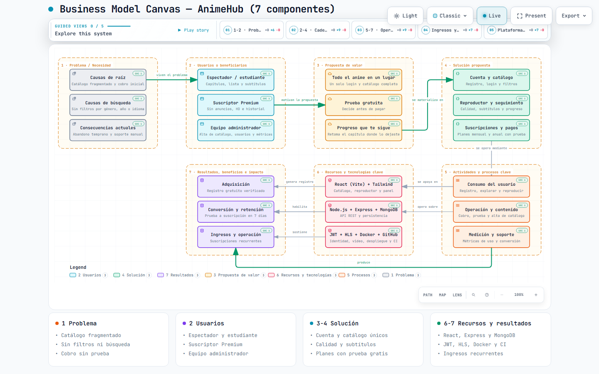
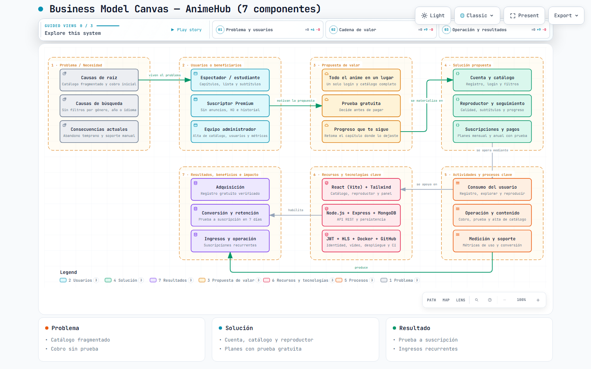

# Business Model Canvas de AnimeHub — 7 componentes

Modelado del **Business Model Canvas del proyecto integrador AnimeHub** con
**Archify**, como HTML autocontenido e interactivo. Es un lienzo **distinto** del
BMC de Crunchyroll que vive en [`../`](../README.md): aquel tiene los 9 bloques
canónicos de una empresa comercial; éste tiene los 7 bloques del proyecto de la
asignación y el contenido sale de
[`analisis-proyecto.md`](analisis-proyecto.md).

---

## Entregable

| | |
|---|---|
| **Abrir el diagrama (GitHub Pages)** | [bmc-animehub-final.html](https://br1anj3sus3b.github.io/Practicas_Integradora_Brian-230308/Practica03/business-model-canvas/bmc-animehub-final.html) |
| **Abrir en local** | doble clic en [`bmc-animehub-final.html`](bmc-animehub-final.html) |
| **Especificación fuente** | [`bmc-animehub-final.json`](bmc-animehub-final.json) |
| **Línea base v1** | [`bmc-animehub-v1.html`](bmc-animehub-v1.html) · [`bmc-animehub-v1.json`](bmc-animehub-v1.json) |
| **Vista previa (v2)** |  |
| **Vista previa (v1)** |  |

El HTML es autocontenido: la tipografía va incrustada en base64 y funciona **sin
conexión**. No depende de scripts externos.

## Archivos

| Archivo | Descripción |
|---------|-------------|
| `README.md` | Este documento. |
| `analisis-proyecto.md` | Análisis previo del proyecto. **Fuente de verdad** del contenido. |
| `prompt-inicial.md` | Prompt inicial con su descomposición de intención. |
| `prompt-final.md` | Prompt que produce la línea base v1, con las restricciones medidas. |
| `enlace-achify.md` | Qué es Archify/Achify y por qué se eligió para este lienzo. |
| `docs/comparativa-v1-final.md` | Actividad de revisión: qué se rechazó y por qué, con receipts. |
| `bmc-animehub-final.json` / `.html` | Entregable final: 21 nodos, 7 regiones, 10 relaciones, 5 vistas, 4 tarjetas. |
| `bmc-animehub-v1.json` / `.html` | Línea base conservada para comparar. |
| `*.visual-check.json` / `.html` | Receipt y hoja de contactos de la verificación en navegador. |
| `*.visual-check.*.png` | Capturas en 1440×900 y 2048×1320, tema claro y oscuro. |
| `canvas-v1.png` / `canvas-final.png` | Capturas de presentación. |

---

## Los 7 bloques y su contenido

| Bloque | Los tres nodos del lienzo | Sublabel del nodo |
|--------|--------------------------|-------------------|
| **1 · Problema / Necesidad** | Causas de raíz · Causas de búsqueda · Consecuencias actuales | Catálogo fragmentado y cobro inicial · Sin filtros por género, año o idioma · Abandono temprano y soporte manual |
| **2 · Usuarios o beneficiarios** | Espectador/estudiante · Suscriptor Premium · Equipo administrador | Capítulos, lista y subtítulos · Sin anuncios, HD e historial · Alta de catálogo, usuarios y métricas |
| **3 · Propuesta de valor** | Todo el anime en un lugar · Prueba gratuita · Progreso que te sigue | Un solo login y catálogo completo · Decide antes de pagar · Retoma el capítulo donde lo dejaste |
| **4 · Solución propuesta** | Cuenta y catálogo · Reproductor y seguimiento · Suscripciones y pagos | Registro, login y filtros · Calidad, subtítulos y progreso · Planes mensual y anual con prueba |
| **5 · Actividades y procesos clave** | Consumo del usuario · Operación y contenido · Medición y soporte | Registro, explorar y reproducir · Cobro, prueba y alta de catálogo · Métricas de uso y conversión |
| **6 · Recursos y tecnologías clave** | React (Vite) + Tailwind · Node.js + Express + MongoDB · JWT + HLS + Docker + GitHub | Catálogo, reproductor y panel · API REST y persistencia · Identidad, video, despliegue y CI |
| **7 · Resultados, beneficios e impacto** | Adquisición · Conversión y retención · Ingresos y operación | Registro gratuito verificado · Prueba a suscripción en 7 días · Suscripciones recurrentes |

**Cada nodo declara su evidencia**: los 21 nodos llevan un `sources` que apunta a
`analisis-proyecto.md` con la línea exacta. La validación lo exige y lo comprueba
con `--repo-root`, así que si esa línea deja de existir la validación falla en
lugar de servir una referencia muerta.

## Mapeo de tipos de nodo → vocabulario del canvas

Archify clasifica los nodos por su rol técnico; el canvas los clasifica por su
rol en el modelo. La equivalencia es una **convención declarada**, no una
categoría nativa de Archify:

| Tipo Archify | Significado técnico | Etiqueta en la leyenda | Bloque |
|--------------|---------------------|------------------------|--------|
| `external` | Actor externo | 1 Problema | Problema / Necesidad |
| `frontend` | Interfaz de usuario | 2 Usuarios | Usuarios o beneficiarios |
| `cloud` | Infraestructura | 3 Propuesta de valor | Propuesta de valor |
| `backend` | Servicio interno | 4 Solución | Solución propuesta |
| `messagebus` | Integración | 5 Procesos | Actividades y procesos clave |
| `security` | Control de acceso | 6 Recursos y tecnologías | Recursos y tecnologías clave |
| `database` | Almacenamiento | 7 Resultados | Resultados, beneficios e impacto |

## Las 10 relaciones

| # | De → A | Etiqueta | Ancho | Variante |
|---|--------|----------|-------|----------|
| 1 | Problema → Usuarios | `viven el problema` | 2.2 | emphasis |
| 2 | Usuarios → Propuesta de valor | `motivan la propuesta` | 2.2 | emphasis |
| 3 | Propuesta de valor → Solución | `se materializa en` | 2.2 | emphasis |
| 4 | Solución → Actividades | `se opera mediante` | 1.6 | default |
| 5 | Actividades → Recursos | `se apoya en` | 1.6 | default |
| 6 | Actividades → Recursos | `opera sobre` | 1.3 | default |
| 7 | Recursos → Resultados | `genera registro` | 1.3 | default |
| 8 | Recursos → Resultados | `habilita` | 1.6 | default |
| 9 | Recursos → Resultados | `sostiene` | 1.3 | default |
| 10 | Actividades → Resultados | `produce` | 2.2 | emphasis |

El grosor codifica jerarquía: 2.2 es el camino principal de creación de valor,
1.6 y 1.3 son aristas de apoyo. Las aristas 7-9 son la razón por la que la v2
añadió el bloque de ingresos: sin ellas el lienzo no explicaba **de dónde sale
el dinero**.

> **Relación Solución → Resultados.** Existe en el modelo de negocio, pero su
> ruta recta cruza la región de Recursos y degrada la legibilidad. Se documenta
> aquí como dependencia narrativa en lugar de dibujarla como arista.

## Vistas guiadas

Cinco recorridos, accesibles con el botón `LENS` o el menú de vistas:

| Vista | Foco |
|-------|------|
| `1-2 · Problema y usuarios` | El problema del mercado y los tipos de usuario que lo sufren |
| `2-4 · Cadena de valor` | De la necesidad del usuario a los módulos que la atienden |
| `5-7 · Operación y resultados` | Procesos y recursos que operan la solución |
| `Ingresos y conversión` | Cómo la prueba gratuita y los planes de pago generan ingresos |
| `Plataforma y tecnología` | React, Express, MongoDB, JWT, HLS, Docker y GitHub Actions |

## Las 4 tarjetas

| Tarjeta | Ítems |
|---------|-------|
| **1 Problema** | Catálogo fragmentado · Sin filtros ni búsqueda · Cobro sin prueba |
| **2 Usuarios** | Espectador y estudiante · Suscriptor Premium · Equipo administrador |
| **3-4 Solución** | Cuenta y catálogo únicos · Calidad y subtítulos · Planes con prueba gratis |
| **6-7 Recursos y resultados** | React, Express y MongoDB · JWT, HLS, Docker y CI · Ingresos recurrentes |

Son 4 y no más por una razón medida: el visor las maquila con
`grid-template-columns: repeat(auto-fit, minmax(280px, 1fr))`, y 5 tarjetas
exigen 1400 px, más que los 1376 px de ancho de lectura a 1440, así que
envuelven a dos filas.

---

## Reproducir la generación

```powershell
# 1. Verificar la herramienta
node bin/archify.mjs doctor

# 2. Validar (las fuentes exigen --repo-root)
node bin/archify.mjs validate architecture Practica03\business-model-canvas\bmc-animehub-final.json --quality showcase --repo-root . --json

# 3. Entregar el HTML autocontenido
node bin/archify.mjs deliver architecture Practica03\business-model-canvas\bmc-animehub-final.json Practica03\business-model-canvas\bmc-animehub-final.html --quality showcase --repo-root . --json

# 4. Verificar el comportamiento en navegador
$env:ARCHIFY_CHROME = "C:\Program Files (x86)\Microsoft\Edge\Application\msedge.exe"
node bin/archify.mjs visual-check Practica03\business-model-canvas\bmc-animehub-final.html --json
```

> `--repo-root` es **obligatorio** aquí, a diferencia del BMC de Crunchyroll: al
> declarar `sources` y `meta.repository`, Archify verifica que el archivo exista
> en la revisión indicada antes de renderizar. Sin él la validación falla con
> `Repository evidence requires /meta/repository`.

> **Idioma.** Todo el contenido autoral está en español. El esquema sólo admite
> `meta.locale: "en" | "zh-CN"`, así que **no** se declara `locale` y la
> interfaz fija del visor (`Export`, `Share`, `Presentation`) queda en inglés.

## Verificación

| Comprobación | Resultado |
|--------------|-----------|
| `validate --quality showcase` | 9/9 · 0 errores · 0 advertencias |
| Cruces de aristas (`properCrossings`) | 0 |
| Holgura mínima etiqueta↔ruta | 46 px |
| `deliver` (especificación) | 12 287 B · `8b2e6501…c4394b` |
| `deliver` (artefacto) | 839 454 B · `d33d15ad…ad69d44` |
| `visual-check` 1440×900 | `pass` · `diagramWidth` 1179 px · texto mínimo 7.89 px |
| `visual-check` 1600×1000 | `pass` · `diagramWidth` 1216 px · texto mínimo 8.14 px |
| `visual-check` 1920×1080 | `pass` · `diagramWidth` 1383 px · texto mínimo 8.60 px |
| `visual-check` 2048×1320 | `pass` · `diagramWidth` 1796 px · texto mínimo 8.60 px |
| Lectibilidad / cromo del visor | `pass` / `pass` · `dockStageGap` 10.22 (mínimo 10) |
| Revisión perceptual de las capturas | **Pendiente de revisor humano** |

Los SHA-256 completos y los intentos rechazados están en
[`docs/comparativa-v1-final.md`](docs/comparativa-v1-final.md).

## Geometría del lienzo

4 columnas × 2 bandas de 3 filas. Nodos de 200 × 56 px en
`x = 40, 375, 710, 1045`; banda superior en `y = 56, 122, 188` e inferior en
`y = 336, 402, 468`; corredor libre en `y = 576` para la arista 10. `viewBox` de
`1285 × 616`.

El ancho está acotado a propósito: el sublabel se dibuja con 8.6 px, y por encima
de unos 1333 px de lienzo deja de proyectar los 6 px mínimos de legibilidad a
1440×900. Las restricciones medidas están en [`prompt-final.md`](prompt-final.md).

## Advertencia sobre los datos

El contenido es un **modelo de referencia elaborado con fines académicos**,
construido a partir del enunciado y del análisis del proyecto. Los resultados
(adquisición, conversión en 7 días, ingresos recurrentes) son **objetivos de
diseño del modelo, no métricas observadas**: el proyecto no tiene datos de
producción. No es un informe financiero.
